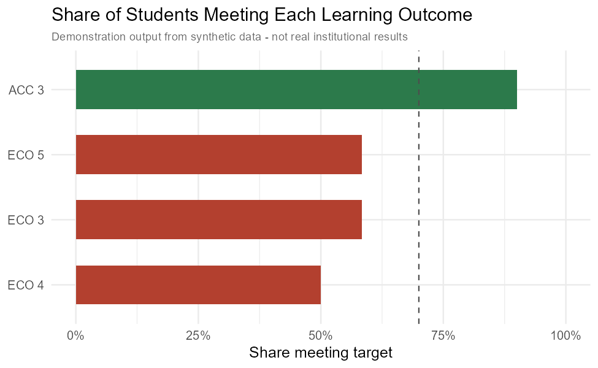

# Program Assessment Reporting

Turns messy, real-world student assessment records — inconsistent rubric
wording, mixed scoring scales, manual backfills — into a clean, comparable
outcome table a college accreditation committee can act on. The
measures themselves (which rubric criteria count toward which learning
outcome) weren't handed down fixed; they were developed and revised as
the data was explored.

## What's here

- `R/int_read.R` / `R/int_munge.R` — read and standardize raw rubric
  exports and instructor survey responses
- `R/report-internal-direct-2019.R` — aggregate the cleaned data to an
  outcome rate per learning goal
- `data-raw/make_synthetic.R` — generates safe stand-in data so the
  pipeline runs without any real student records
- `data/README.md` — documents the source schema and every data-quality
  quirk the cleaning code corrects for



## How to run

This project uses [`renv`](https://rstudio.github.io/renv/) to keep package
versions reproducible. After cloning the repository, open the R project and
restore its packages once:

```r
renv::restore()
```

When intentionally adding or updating a package, install it with
`renv::install()` and commit the updated lockfile created by
`renv::snapshot()`.

```r
# Generate the synthetic input files.
source("data-raw/make_synthetic.R")
```

Copy `.Renviron.example` to `.Renviron` (already points at the committed
synthetic data), then:

```r
source("R/report-internal-direct-2019.R")
source("R/plot_outcomes.R")
```

## How to test

After restoring the `renv` environment, run the unit, input-validation, and
synthetic end-to-end tests from the project root:

```sh
Rscript tests/testthat.R
```

To run against real data instead, point `ACBSP_DATA_PATH` at the directory
containing the four assessment input workbooks (see `.Renviron.example`).

## What this demonstrates

Turning ambiguous raw data into a coherent measurement framework — not
just cleaning it, but deciding what it should mean — plus building a
reproducible R pipeline and working within student-privacy constraints
(real data never enters this repo; see `data/README.md`). For the fuller
story, including how the outcome categories emerged through exploratory
analysis: **[docs/CASE_STUDY.md](docs/CASE_STUDY.md)**.
